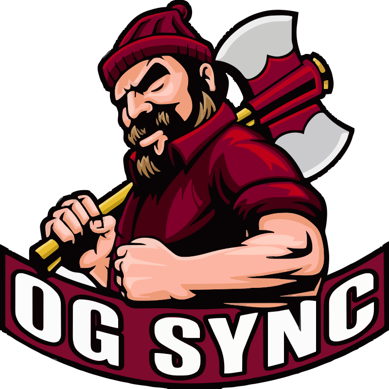

# OG Sync

OG Sync is a personal school dashboard that combines Google Classroom and My Oak Grove (Blackbaud) assignments, official grades, class schedules, planning, and focus tools in one browser app.

[Open the production app](https://daymark-dynamicdigital.vercel.app) · [View the public repository](https://github.com/DynamicCodes999/og-sync)

## Features

- Automatic, duplicate-safe assignment imports from Google Classroom and Blackbaud
- Automatic Blackbaud grade import with each teacher’s official current percentage, including weighted gradebooks
- Teacher instructions, assignment links, personal notes, subtasks, and attachments
- Planner views grouped by class, calendar views, assessment highlighting, and missing-work warnings
- Morning brief with today’s classes, due work, upcoming tests, and estimated workload
- White/Maroon block schedule with periods, rooms, and a next-class view
- Custom Pomodoro work time, break time, block count, transition bell, and focus history
- Light and dark themes, responsive layout, PWA installation, JSON backups, and cross-device cloud state

## How automatic sync works

Vercel hosts the app and its authenticated state API. A trusted Mac runs the local helper, keeps the Google and Blackbaud sessions in `.data/scraper-profile`, and sends normalized school data to private Vercel Blob storage.

The helper checks both providers every minute while the Mac is awake and online. It keeps one authenticated Chromium session minimized so Blackbaud stays signed in without stealing focus. A visible browser appears only when you explicitly choose a provider sign-in action, then minimizes on the next successful sync. Google and Blackbaud use separate tabs, so one provider failing does not block the other. The hosted app checks for cloud updates every 15 seconds while open.

Blackbaud supplies the official course percentage and published assignment scores. OG Sync does not recalculate weighted grades from raw points. Repeated grade imports update the existing record instead of creating duplicates.

The helper prevents idle sleep while the Mac is plugged into power. Keep the lid open and the Mac online during school; closing the lid still suspends imports. If the Mac is asleep or offline, the hosted app continues working with its latest cloud state. Imports resume automatically when the Mac wakes; no Codex prompt is required.

## Use OG Sync on another computer

1. Open [OG Sync](https://daymark-dynamicdigital.vercel.app).
2. On the trusted Mac, open Terminal in this project and run:

   ```bash
   grep '^DAYMARK_SYNC_KEY=' .env.local
   ```

3. Copy only the value after `=` into the **OG Sync key** field.
4. Do not save the key on a shared computer.

This is an OG Sync access key, not a Google, Blackbaud, or school password. Remove it from a browser with **Sync & import → Change sync key** or by clearing the site’s browser data.

## Local setup

Requires Node.js 20 or newer.

```bash
git clone https://github.com/DynamicCodes999/og-sync.git
cd og-sync
npm install
npx playwright install chromium
cp .env.example .env.local
```

Configure `.env.local`, then install the background helper:

```bash
npm run helper:install
```

Open [http://localhost:4173/#sync](http://localhost:4173/#sync), open each provider’s sign-in browser, and sign in only on the official Google Classroom and My Oak Grove pages. Never enter school credentials into OG Sync itself.

Run `npm start` instead when you want the helper in the foreground. Useful maintenance commands:

```bash
npm run helper:uninstall
tail -f .data/helper.log .data/helper-error.log
```

## Vercel setup

Create a Vercel project from this repository and add private Blob storage. Configure these environment variables in Vercel:

- `DAYMARK_SYNC_KEY`: a random private bearer key containing at least 32 characters
- `BLOB_READ_WRITE_TOKEN`: the Vercel-managed private Blob credential

Generate a sync key with `openssl rand -base64 32`. Store the same result in Vercel and on the trusted Mac; never commit it.

Configure the trusted Mac in `.env.local` with the same key:

```dotenv
DAYMARK_CLOUD_URL=https://your-project.vercel.app
DAYMARK_SYNC_KEY=your-random-private-key
DAYMARK_AUTO_SYNC_SECONDS=60
```

The `DAYMARK_*` names are retained internally for deployment compatibility.

## Privacy and security

The repository is public, but user data and credentials are not part of it. `.env`, `.env.local`, `.data`, `.vercel`, and build dependencies are ignored by Git.

The cloud receives only classes, assignments, secure assignment URLs, completion state, published grades, official course percentages, and sync timestamps. Google and Blackbaud passwords, cookies, MFA codes, and browser profiles remain on the trusted Mac.

Never commit `.env`, `.env.local`, `.data`, or `.vercel`. Rotate `DAYMARK_SYNC_KEY` immediately if it is exposed.

## Duplicate and deletion rules

OG Sync first matches a provider’s stable assignment or grade ID. Assignments appearing in both providers fall back to normalized title, matched class, and due date. A different class or due date remains separate.

Deleting imported work creates a deletion marker so the next import does not recreate it. Revision checks merge concurrent cloud changes instead of silently overwriting them.

## Verify changes

```bash
npm test
npm run build
```

The test suite covers provider parsing, automatic grades, duplicate protection, deletion behavior, cloud conflicts, assignment details, block rotation, focus cycles, missing-work detection, and date handling.
